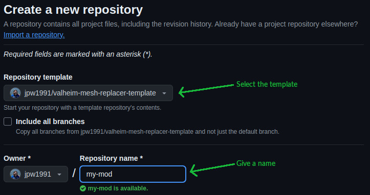
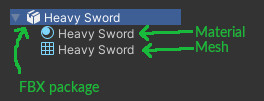
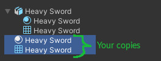
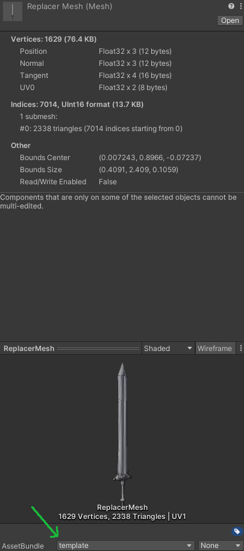
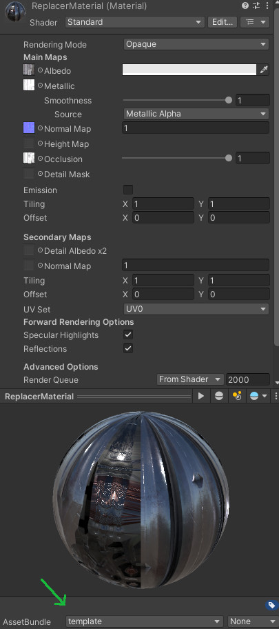
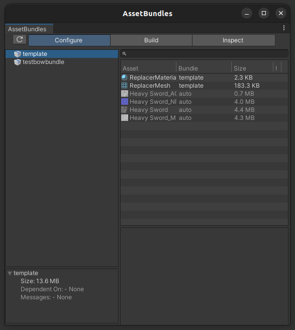
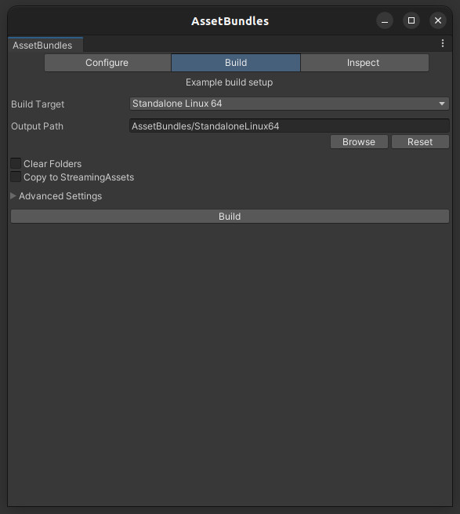

# Cheb's Valheim Mesh Replacer Template

A template tailored toward beginners to easily replace a mesh and material of a vanilla Valheim item. It is based on my Demolisher Hammer replacer mod.

## Video Tutorial

I recommend you watch my tutorial [video]() on how to use this. You may also consult the written guide below.

## About Me

[](https://necrobase.chebgonaz.com)
[](https://ko-fi.com/chebgonaz)
[](https://www.patreon.com/chebgonaz?fan_landing=true)

I'm a YouTuber/Game Developer/Modder who is interested in all things necromancy and minion-related. Please check out my [YouTube channel](https://www.youtube.com/channel/UCPlZ1XnekiJxKymXbXyvkCg) and if you like the work I do and want to give back, please consider supporting me on [Patreon](https://www.patreon.com/chebgonaz?fan_landing=true) or throwing me a dime on [Ko-fi](https://ko-fi.com/chebgonaz). You can also check out my [website](https://necrobase.chebgonaz.com) where I host information on all known necromancy mods, games, books, videos and also some written reviews/guides.

Thank you and I hope this template helps you! If you have questions or need help please join the [Discord](https://discord.gg/BweDFym6sc) and ping me.

## Things you'll need

**Patience** and a small degree of **technical competence** and **tenacity**. Every component of this is a rabbit hole on its own and I only skim the surface of what there is to know, and what you need to know, to pull this off.

- A GitHub account
- Git
- An IDE for compiling with:
    - On Linux, Rider is the best choice.
    - On Windows, you can use either Rider or Visual Studio
- Unity
- A 3D model in FBX format
- Textures for that 3D model (if they're not already inside the FBX file)
- Valheim and BepInEx installed

## Things you might need

- Blender
  - Useful for resizing, rotating, etc. the mesh.
  - Useful for converting non-FBX to FBX

**Trivia:** FBX is a proprietary 3D format used by Unity. The best open equivalent to this is GLTF 2.0. Another common model format is OBJ.

# Written Tutorial

**Disclaimer:** This guide is intended to get you on your feet as fast as possible, but omits a lot of fundamental/important knowledge. By the end of it you will have something that works but a lot of questions. Future learning will be required from you beyond this guide.

## 1. Creating your repository with the template



## 2. Cloning the repository

On your command line, navigate to somewhere you want to store the project. These commands will work on both Linux and also on Windows from within the git bash terminal:

```shell
git clone your-repository-cloning-url-here
```

Replace the `your-repository-cloning-url-here` with the cloning URL of your repository. This can be either an http address which looks similar to `https://github.com/jpw1991/template-test` or an ssh address like `git@github.com:jpw1991/template-test.git`

## 3. Renaming the repository

After cloning, the repository will be identical to the template. It needs to be renamed to whatever you wish your mod to be. I have prepared two separate scripts to assist with this purpose, but you may also do it yourself by hand if you prefer.

To use the scripts, find and edit the `rename_template.sh` if you're on Linux, otherwise edit the `RenameTemplate.ps1` if you're on windows. Change the parts of the script which have different versions of `MyMod` to be whatever name you want your mod to be and execute the script.

## 4. Creating your bundle

The bundle is a Unity asset bundle file which will store your replacement mesh (the 3d model) and replacement material (textures) inside it. A material can be considered as a collection of different textures that constitute the painting of the mesh & its appearance in-game.

I have an empty Unity project that's set up correctly for you in the template already. It also already has the Demolisher Sword mesh and material in there so you can inspect it if need be. Open Unity and then choose the add existing project option and choose the `MyModUnity` or equivalent folder. If it wants to convert the project version or whatever, let it. This is a near empty project and converting can't harm anything.

### 4.1 Adding your FBX

Drag and drop or copy your FBX file into the project.

### 4.2 Examining the FBX

The FBX file format is something Unity uses and it's like a package that can contain all kinds of things. Typically it contains at least a mesh and a material. For the scope of our endeavour, that's all we care about. If you look at the FBX in Unity you will see the material and mesh inside it:



We want to create copies of these things. Do to that, simply select the material and mesh and press Ctrl+D (short-cut for duplicate). You should now see:



These copies exist on their own separately from the FBX file and can be freely modified. You may wish to also rename them. For this guide I'm renaming them to `ReplacerMesh` and `ReplacerMaterial`.

### 4.3 Setting up your material

Depending on what's inside the FBX to begin with, you may not need to do this. But check that the material has its slots appropriately filled by assigning the textures to the appropriate slots. There is no one way to do this, as it depends on what textures are available for your model. But at a minimum, there is probably an albedo (the base color) and a normal map.

### 4.4 Assigning the asset bundle

Click your material and assign it to a new asset bundle. It can be named anything you want, but an appropriate name might be something like the name of your mod with bundle on the end. Bundles must be all lower case. For this demo, I'm just gonna call it `template`. Make sure you've assigned both the mesh and the material to this asset bundle. You can check my examining them:

Mesh | Material
--- | ---
 | 

### 4.5 Building the asset bundle

At the top of the Unity window, click Windows -> Asset Bundle Browser. This will then open and you can check that everything that should be inside your bundle is inside your bundle. There should be the mesh, the material, and probably textures (these are automatically dragged in as dependencies of the material):



Then pop over to build and select the right settings for your system (eg. Windows if on Windows) and then build:



### 4.6 Finished

Assuming there are no errors, which there usually won't be, you'll have now built the asset bundle. It will be needed later.

## 5. Adjusting the solution

Assuming you have either Rider or Visual Studio installed, double click on the solution file which will now be named something like `YourMod.sln` depending on what name you decided to assign during the renaming phase.

### 5.1 Fixing the errors

When you open the solution, it will be unable to compile because the paths will be probably be wrong. In laymans terms, the solution has no idea where to find Valheim and BepInEx and needs to be told where these things are.

Find and edit the project file in a text editor (or from within Rider/VS via right click). You need to find and fix every reference to point to something on your drive. For example:

```xml
    <Reference Include="BepInEx">
      <HintPath>..\..\..\.config\r2modmanPlus-local\Valheim\profiles\cheb-development\BepInEx\core\BepInEx.dll</HintPath>
    </Reference>
```

Might need to become:

```xml
    <Reference Include="BepInEx">
      <HintPath>C:\Program Files (x86)\Steam\steamapps\common\Valheim\profiles\cheb-development\BepInEx\core\BepInEx.dll</HintPath>
    </Reference>
```

It depends on your system. Use your patience and the aforementioned technical tenacity to figure it out.

### 5.2 Compiling

After all the errors have been fixed, the project should compile easily. After compiling you should have a `bin` folder and opening it up and drilling down further will eventually lead to a folder with many DLLs inside. One of them will be `MyMod.dll` or whatever you renamed the project to. This is what you will later install and/or distribute, along with the asset bundle (more on that later).

### 5.3 Editing

Edit the project's main C# file (probably called `MyMod.cs`) and edit the following lines near the top of the file:

```csharp
        public const string PluginGuid = "com.chebgonaz.mymod";
        public const string PluginName = "MyMod";
        public const string PluginVersion = "0.0.1";

        private string _vanillaPrefab = "SledgeDemolisher";
        private string _bundleName = "template";
        private string _meshName = "ReplacerMesh";
        private string _materialName = "ReplacerMaterial";
```

Property | Explanation
--- | ---
`PluginGuid` | This is a unique identifier for your mod. Make it something unique and best practice is for it to be a backwards URL. It doesn't need to correspond to an existing website. The main thing is that it's unique. If your name is Bob and your mod is called Vampire Sword I recommend something like `com.bobsmods.vampiresword`.
`PluginName` | Your mod's name. This should already be correct if you used the scripts. If not, change it to whatever your mod's name is.
`PluginVersion` | The mod version. While your mod is in development/unfinished, it should be less than `1.0.0`. Every time you make a fix or improvement, increase the version. This doesn't matter much at this stage, but is important should you wish to publish your mod.
`_vanillaPrefab` | This is the prefab name of the vanilla Valheim item you want to replace.
`_bundleName` | The name of your asset bundle from step 4.
`_meshName` | The name of your mesh within the bundle.
`_materialName` | The name of your material within the bundle.

### 5.4 Recompile

With the changes we just made, you can now compile again and your mod is ready to test.

## 6. Testing

Go and take your DLL file from the build folder. It will be something like `YourMod/bin/net48/YourMod.dll` and chuck it in your BepInEx folder, along with the asset bundle. They should be side by side. Start the game and everything should work. 